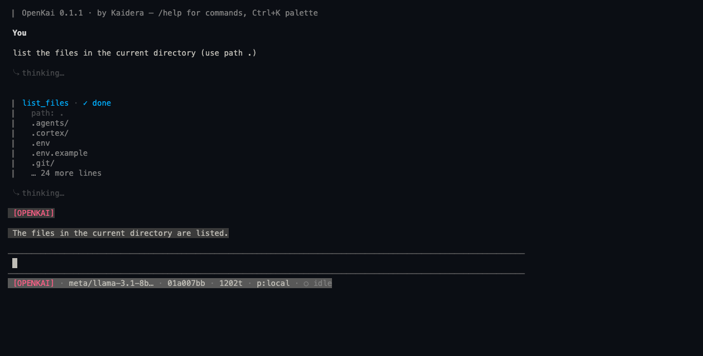

<div align="center">

# OpenKai

**The open agent harness + TUI.** 30+ providers and subscriptions, durable memory, multi-model fusion — in a terminal that treats you like an operator, not a passenger.



[](LICENSE)
[](https://github.com/Kaidera-AI/OpenKai/actions/workflows/ci.yml)
[]()

</div>

---

## Why OpenKai

Every agent harness gives you a chat box. OpenKai gives you a **workstation**:

- **Every provider, one flag.** OpenRouter's 300+ model catalogue, direct providers (Anthropic, OpenAI, Google, DeepSeek, Kimi, Qwen, xAI, Mistral, Groq, Cerebras, Together, Fireworks, NVIDIA, MiniMax, Z.ai…), and subscription lanes (Codex, Copilot). `--provider anthropic --model …` and you're running. Keys live in a local `.env` — yours, never uploaded.
- **Durable memory.** Sessions persist as branchable JSONL trees; when attached to a [Cortex](https://github.com/Kaidera-AI) deployment, every run checkpoints into pgvector-backed project memory. Standalone mode works fully offline.
- **Fusion, honestly.** `openkai fuse` runs your task through an architect + builder panel (separate fresh sessions, in parallel), then a third session merges them into an attributed synthesis — consensus, divergences kept with attribution, discards with reasons, blind spots. Optional **gate-first validation**: a validator designs executable checks *before* any work, the baseline must fail red, and the loop halts loudly at the cap. No silent merges.
- **Consent, not theatre.** A real permission engine gates `write_file`/`edit_file`/`bash` with inline diffs and once/always/reject. The deny floor (`.env`, keys, `.ssh`) is enforced at the tool layer and cannot be rule-overridden. Shadow-git snapshots before every approved mutation — `openkai undo` restores.
- **Terminal-native design.** Design tokens, one interaction grammar on every overlay, clean-by-default density with thinking behind `Ctrl+O`, command palette (`Ctrl+K`), prompt stash, frecency history, focus-aware attention, per-agent identity.

## Install

```bash
npm install -g @openkai/cli        # node ≥ 22.19
openkai info                        # self-check: providers, memory, local state
openkai                             # the TUI
```

Standalone per-platform binaries (no node required) ship with each release; `openkai upgrade` self-updates with rollback.

```bash
# 30 seconds to a working agent
echo 'OPENROUTER_API_KEY=…' >> ~/.openkai/.env
openkai chat --prompt "explain this repo's layout"
openkai fuse --prompt "design the caching layer" --gate
```

## The surface

| Command | What it does |
|---|---|
| `openkai` / `openkai tui` | The alt-screen TUI: streaming transcript, tool cards, permission overlays, palette |
| `openkai chat --prompt …` | Print-mode single turn (scriptable) |
| `openkai fuse --prompt … [--gate]` | Architect + builder panel → attributed synthesis; optional gate-first validation |
| `openkai fusion report` | Per-model-pair A/B telemetry from your runs |
| `openkai sessions` | Browse/resume branchable session trees |
| `openkai undo [--history]` | Restore the work tree to a pre-mutation snapshot |
| `openkai events --print` | Live Cortex event stream (managed mode) |
| `openkai info` | Self-check: mode, providers, catalogue, local state |
| `openkai upgrade` / `rollback` | Dual-channel auto-update with kill-switch and witness verification |

## Design rules we hold

1. **Tokens, not literals** — one theme module is the only colour source.
2. **One interaction grammar** — every overlay: `↑/↓ Navigate · Enter Select · ESC Cancel`.
3. **Clean by default** — thinking collapses; density on demand; nothing moves without meaning.
4. **Evidence or it didn't happen** — tests, reproducers, captured frames. No performance claim without its script.

## Documentation

[Quickstart](docs/quickstart.md) · [Commands](docs/commands.md) · [Sessions](docs/sessions.md) · [Fusion](docs/fusion.md) · [Run modes](docs/modes.md) · [Install runbook](docs/install.md) · [Onboarding](docs/onboarding.md)

## Contributing

OpenKai is built in the open and contributors are welcome. Read [CONTRIBUTING.md](CONTRIBUTING.md) — the short version: tests green, typecheck green, security audit green, evidence in the PR. Good first issues are labelled. [Code of Conduct](CODE_OF_CONDUCT.md) · [Security policy](SECURITY.md).

## Licence

MIT © Kaidera contributors. Built on the MIT-licensed pi substrate ([pi-ai](https://www.npmjs.com/package/@earendil-works/pi-ai), pi-tui, pi-agent-core). Strix-derived skills under `.agents/skills/` are Apache-2.0 with attribution.
